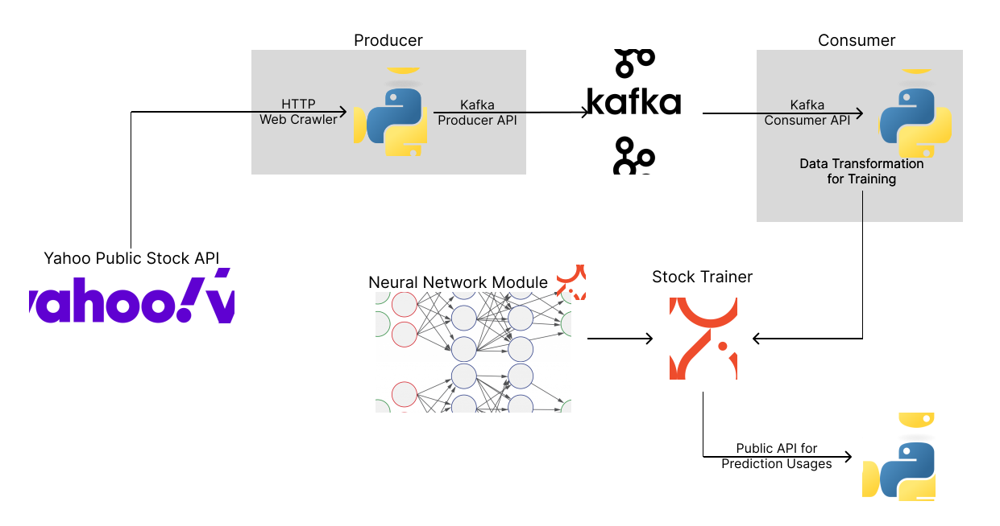

# regression

A set of real-time microservices for collecting and managing stock and cryptocurrency data with Apache Kafka and PyTorch

#### Quick Links
- [Architecture Overview](#architecture-overview)
    - [System Design](#system-design)
    - [Summary](#summary)
    - [Benchmarks](#benchmarks)
- [Step-by-step Instructions for Local Usages](#step-by-step-instructions-for-local-usages)
    - [Requirements](#requirements)
    - [Setup](#setup)
    - [Initialize Kafka Topics](#initialize-kafka-topics)
    - [Building the Base ML Model](#building-the-base-ml-model)
    - [Starting the Long-running Producer and Consumer Jobs](#starting-the-long-running-producer-and-consumer-jobs)
        - [Consumer](#consumer)
        - [Producer](#producer)

## Architecture Overview

### System Design

### Summary
Real-time stock data are pulled from Yahoo's public API, which provides prices of different
stocks/cryptocurrencies. These data, after filtering, cleaning and transformation, and pushed
to Kafka topics through producers.

The Kafka consumers read data from the topics, transform then into embeddings, aggregate the data
into traning sets and testing sets before finally feeding them into the neural network module.

The neural networks takes in the data of a particular stock for the past 30 minutes and predict the
prices for the next 10 minutes.

### Benchmarks
The neural network has a layout of
- 15 (input layer)
- 40 (1st hidden layer)
- 20 (2nd hidden layer)
-  5 (output layer)

The back-propagation algorithm used for this model is Stochastic Gradient Descent (SGD) with
`mse_loss` being the loss function.

On the BTC-CAD data, the learning process converges after around 20 iterations, with the following
benchmark:
- Train loss: 4721020.826
- Val loss: 4764985.904
- Accuracy: 97.176862%

## Step-by-step Instructions for Local Usages

### Requirements
1. Clone the respository
2. Have Apache Kafka installed
3. Have Python3 installed
<!-- 4. Have Docker Installed -->

### Setup
1. After installing Apache Kafka
2. Navigate into the `kafka_2.13-3.6.1` folder
3. Start up the ZooKeeper by running `bin/zookeeper-server-start.sh config/zookeeper.properties`
4. Start up the Kafka broker by running `bin/kafka-server-start.sh config/server.properties`
<!-- 5. docker stuffs... -->

 
*The instructions below should be executed within the /src directory*

### Initialize Kafka Topics
Run `python3 kafka_init.py` to create the Kafka topics for each of the stocks/cryptocurrencies listed
under `stock_names.py`

### Building the Base ML Model
Run `python3 train_model.py [currency-abbr]` to read all existing data from the `currency-abbr` Kafka
topic. `currency-abbr` defaults to BTC-CAD, see `stock_names.py` for examples.

The `train_model.py` program will save the model as the `model_data` file, and picks the file up for
future runs.

Run `train_model.py` repeatly to train and improve the model. Each run goes through 5 epochs 
to prevent `CPU time exceeded` error.

### Starting the Long-running Producer and Consumer Jobs

Both producer and consumer are real-time long-running jobs; they require manual termination.

#### Consumer
Running `python3 consumer.py [currency-abbr]` will start listening for new records in the Kafka
topic, and train the model upon getting new records.
#### Producer
Running `python3 producer.py` (on a different terminal) will periodically pull real-time stock data
from Yahoo's API. The full list of data it pulls are specified in `stock_names.py`.

<!--
bin/kafka-console-consumer.sh --topic BTC-CAD --from-beginning --bootstrap-server localhost:9092
bin/kafka-console-producer.sh --topic BTC-CAD --bootstrap-server localhost:9092
-->
